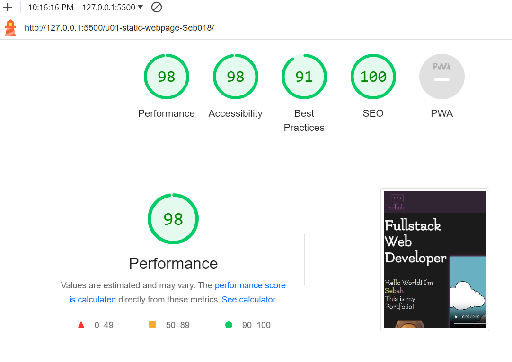
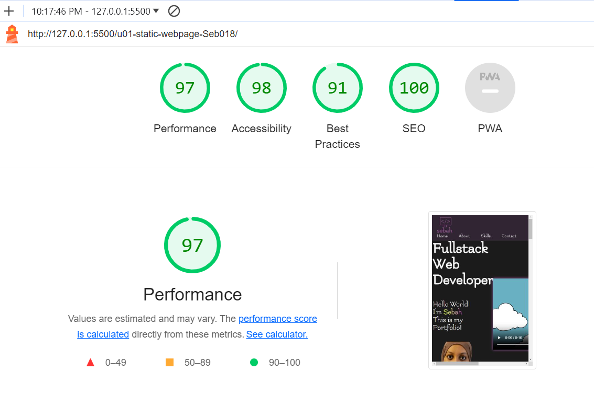
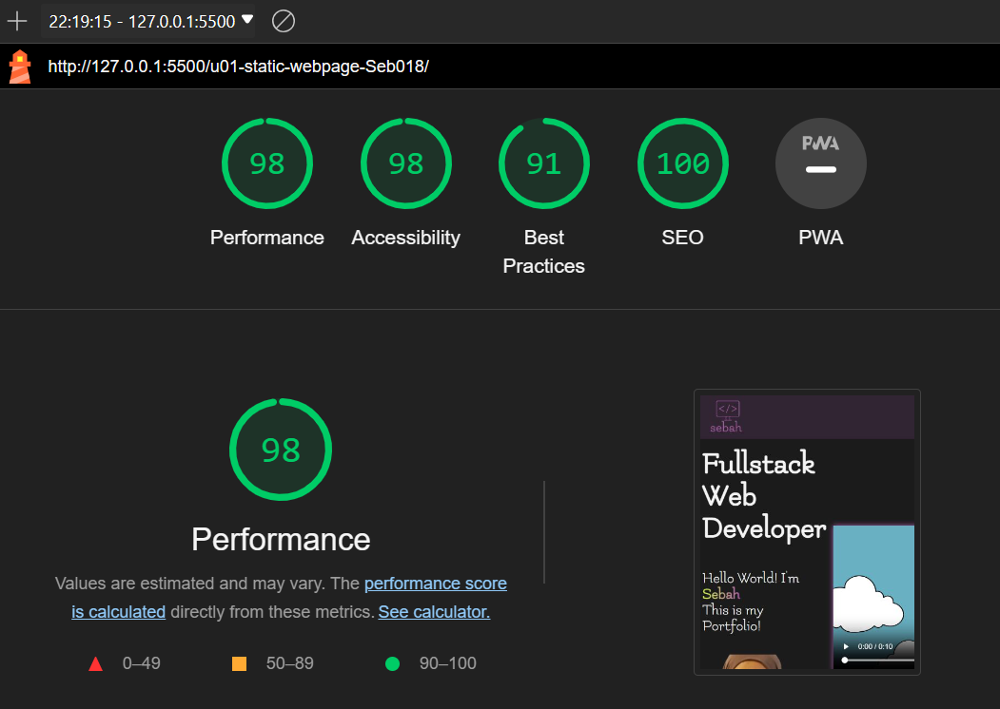
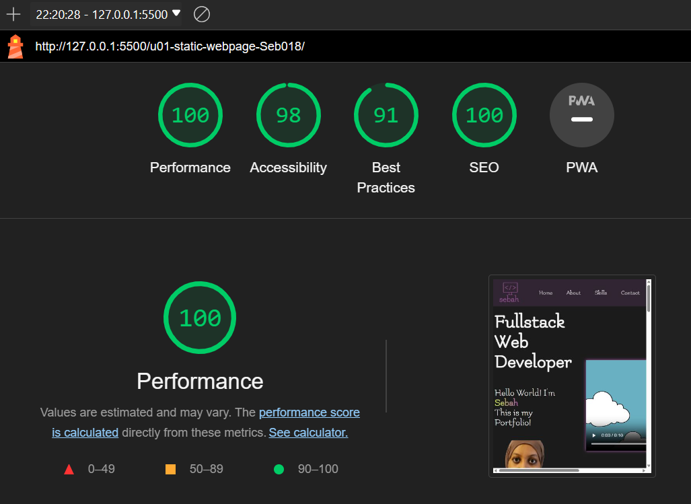

My first project in the web development journey! ^^

## Validated Code

I have validated the code both in css and html validatior and added the validation imahes in footer.
As for lighthouse report for mobile and desktop, I have done it in both Chrome and Microsoft Edge.
And these are the results i got:

